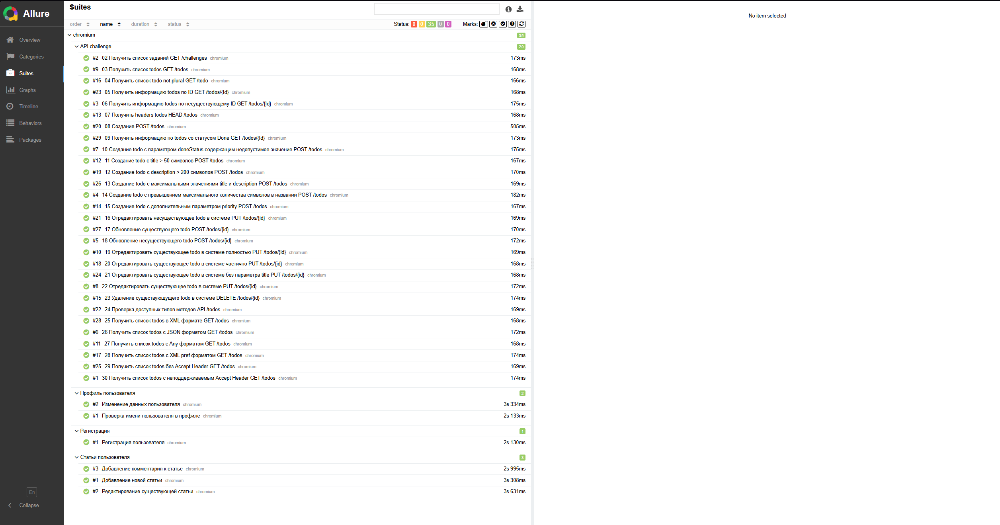
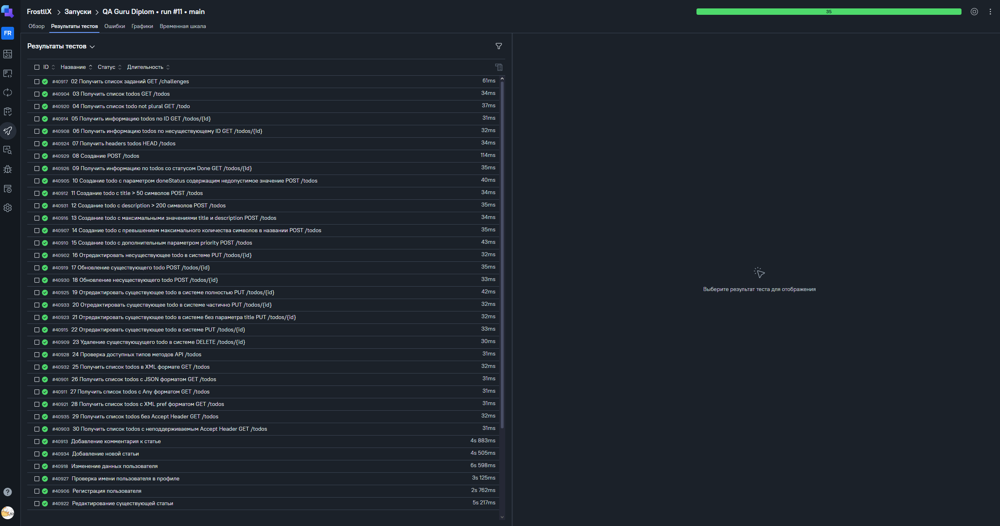
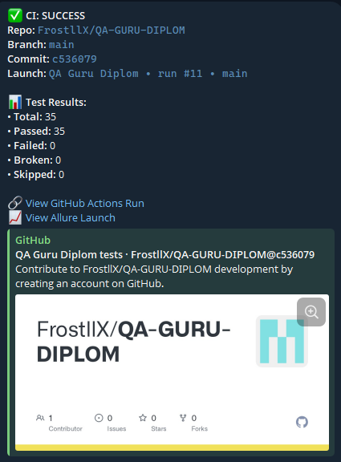

<h1 align="center">Дипломный проект автоматизации тестирования JS+PlayWright</h1>

##  Содержание:
- <a href="#autotests"> Запуск автотестов</a>
- <a href="#generateAllureReport"> Генерация отчетов</a>
- <a href="#allureReport"> Пример Allure-отчета</a>
- <a href="#allureTestOpsReport"> Пример Allure TestOps-отчета</a>
- <a href="#tg"> Уведомления в Telegram с использованием бота</a>

Этот проект представляет собой набор автоматизированных тестов, написанных на <code>JavaScript</code> с использованием фреймворков <code>[Playwright](https://playwright.dev)</code> и <code>[Allure](https://allurereport.org/)</code>. Playwright предоставляет мощный инструментарий для веб-автоматизации, а Allure добавляет возможности для красивой и удобной отчетности.


Для удаленного запуска реализован <code>Github</code> action с формированием Allure-отчета и отправкой результатов в <code>Allure TestOps</code> и <code>Telegram</code> при помощи бота.

<a id="autotests"></a>
____
## ▶️ Запуск автотестов, генерация отчетов

### Запуск тестов из терминала

Для запуска всех тестов использовать команду ниже:
```
npm test
```
Для запуска тестов на API:

```
npx playwright test --grep "@API"
```
Для запуска тестов на UI:
```
npx playwright test --grep "@UI"
```

<a id="generateAllureReport"></a>
_____
### Генерация отчетов Allure из терминала

Для генерация отчетов использовать команду ниже:
```
npm run allure:serve
```
____
<a id="allureReport"></a>
##  </a> Пример <a target="_blank" href="https://"> Allure-отчета </a>
<p align="center">

</p>

____
<a id="allureTestOpsReport"></a>
##  </a> Пример <a target="_blank" href="https://allure.autotests.cloud/"> Allure TestOps-отчета </a>
<p align="center">

</p>

____
<a id="tg"></a>
##  Уведомления в Telegram с использованием бота
После завершения сборки бот, подключенный к <code>Telegram</code>, автоматически собирает результаты тестов и отправляет сообщение с отчетом о прохождении тестов в чат.
<div style="background-color: #18222d">
<p align="center">

</p>
</div>